## Hi there 👋 I'm SHIKADA HIROTO

[](https://github.com/anuraghazra/github-readme-stats)


# [](https://github.com/bambi01-95/SHICA)   SHICA 
### (C/C++)
is my reseach topic.

私のリサーチ内容です！

SHICAというマルチエージェントシステム向けの言語です。

開発中なので、使用しないでくださいd-.-b

```shica
event touch = trigReadGPIO()
state default{ 
    entry(){
        print("Now I am default")
    }
    touch(int num) {
        print("Ouch, don't prod me!");
        state upset;
    }
}

state upset { // object has been clicked at least once
    entry() {
        print("Now I am upset.");
        init timer5Sec = timerSec(5);
    }
    touch(int num) {
        print("Really, stop clicking me, it hurts!");
        timer5Sec.reset(); // reset countdown
    }
    timer5Sec(int s) {
        state default;
    }
}
```


# [](https://github.com/bambi01-95/mechatro3app) mechatoro3app
### (Swift)
X is the code for mechatoro's rober controller (iOS)

開閉2輪ローバーのスマートフォンコントローラーです。

スティック、ボタン、ジャイロの3つの操作方法と./mechatoroのモードによっては、VR形式の映像も楽しめます！

<p align="center">
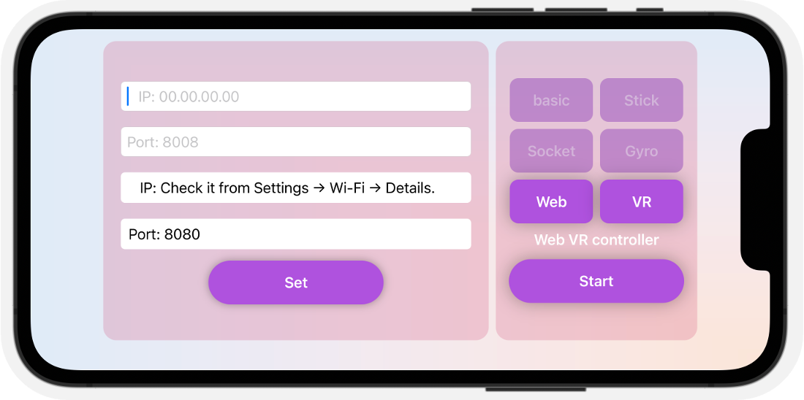
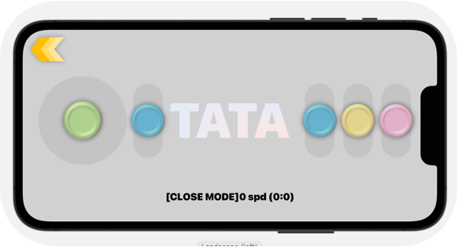
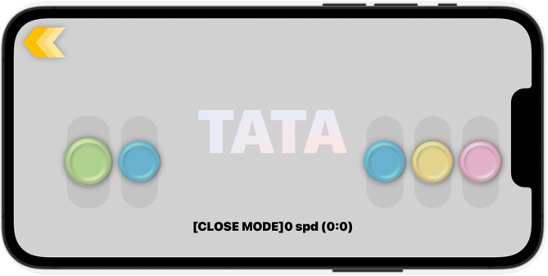
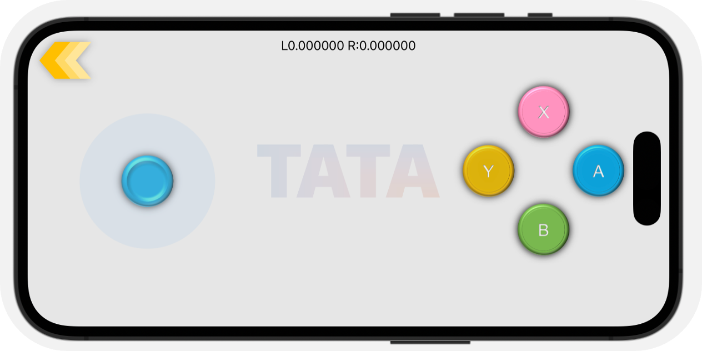
</p>

## [mechatoro](https://github.com/bambi01-95/mechatoro)
### (python,C++)
is the code that controls the expandable 2-wheeled rover!!!

開閉2輪ローバーの制御コードです。

pygameやDjangoを使用して、webやwindowを使用してモニターや制御を行えます。

<p align="center">
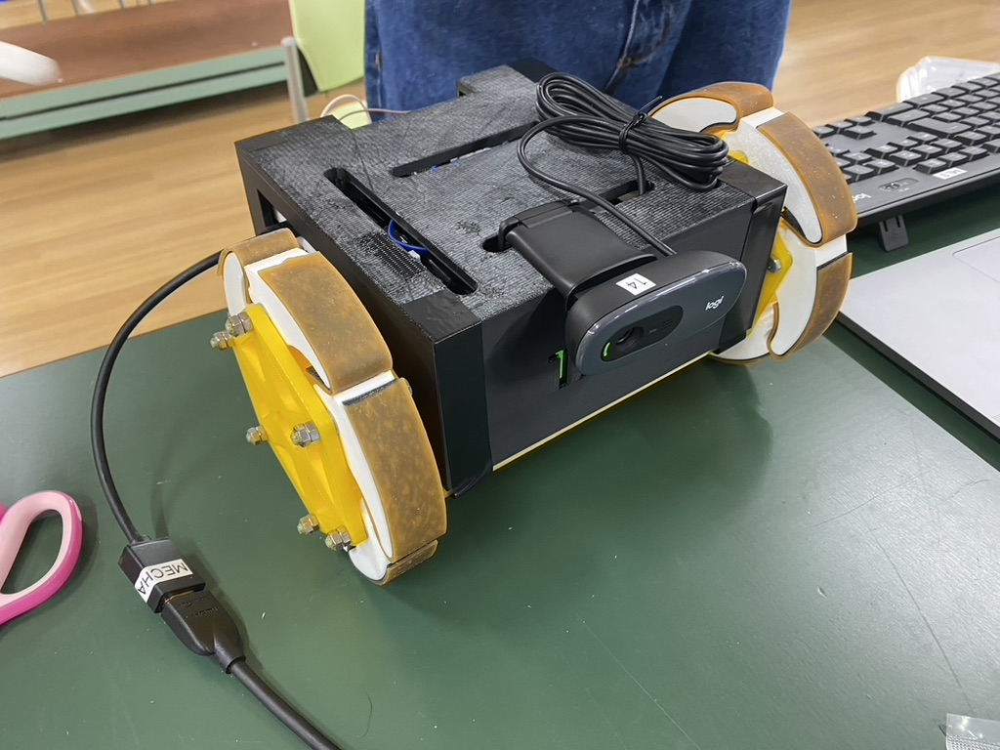
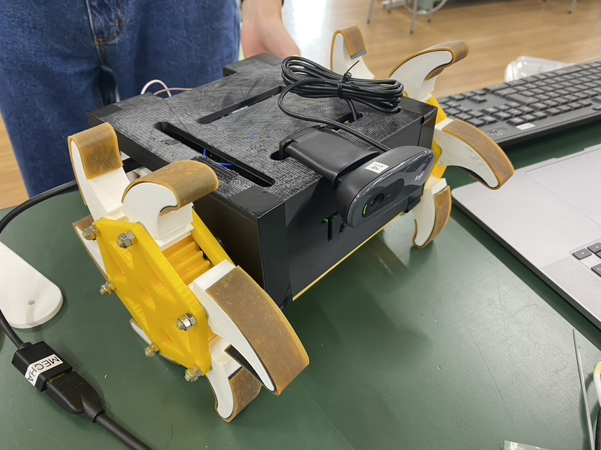
</p>


# [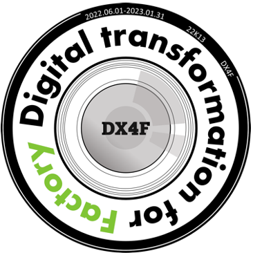](https://github.com/bambi01-95/precap2022_22K13_Inspection) precap2022_22K13_Inspection
### (Python[Tensor flow, Django, Open CV], SQLite, JS, HTML/CSS)
is the code for the inspection machine (Web app). but not exist lol. It's secret.

企業と共同で検品処理装置とそのウェブアプリケーションの開発を行いました！

[プロジェクト記事](https://www2.deloitte.com/jp/ja/blog/group/2022/thesmartfactory-kyoto-news-01-capstone-project.html)


<p align="center">
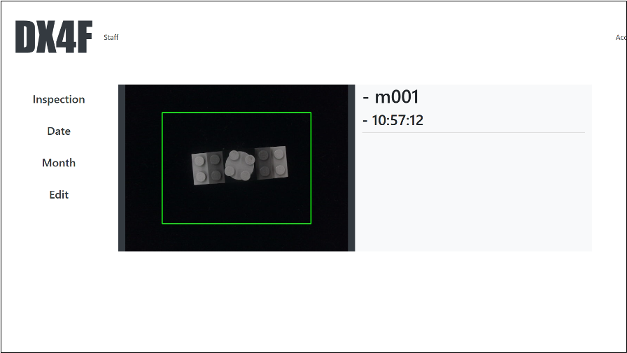
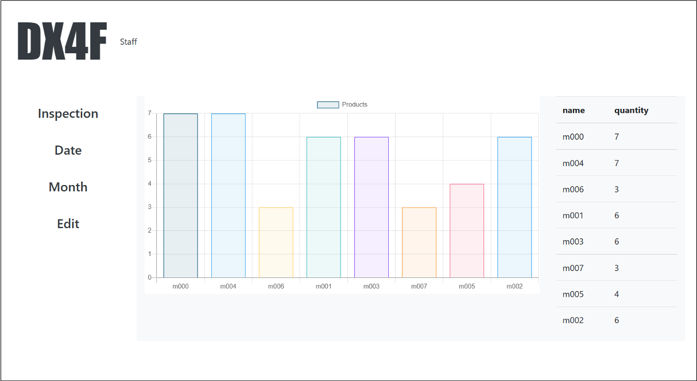
</p>

# [](https://github.com/bambi01-95/Dear)  Dear

is now in porgress... Please wait 2 month!!!

it makes your uni. life more fun!!!

Below is the design for the planned 'Home page'.

<p align="center">
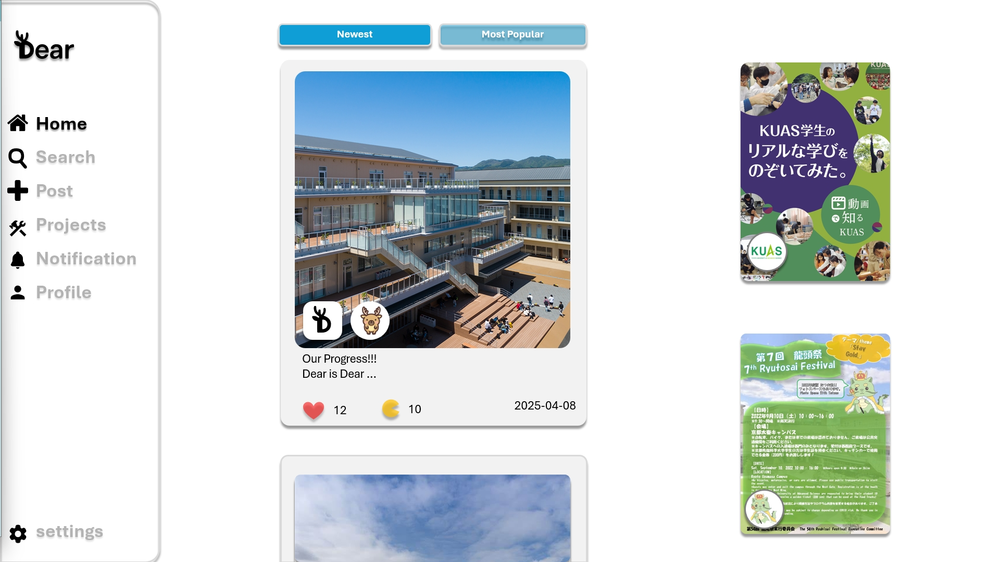
</p>

# 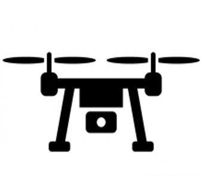 droneshow_sw
### (Unity: C# & Python)
is now .... 
## droneshow_cont(C/C++)
is now ....


### I Want to Develop: 

- SNS for corner-stone and cap-stone project. 

- VR implementation of TENJI block (integrated with a smart white cane) 

- holographic display and its app